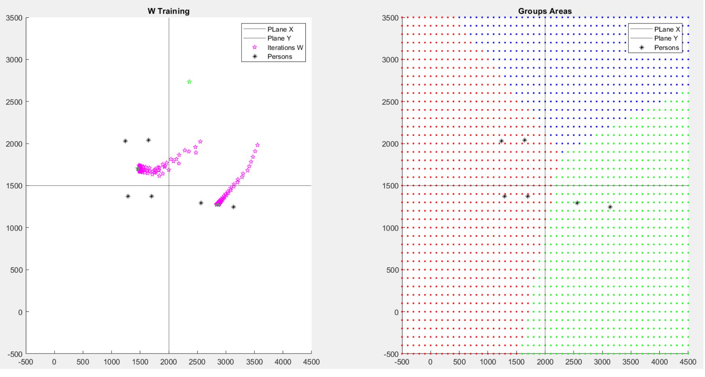
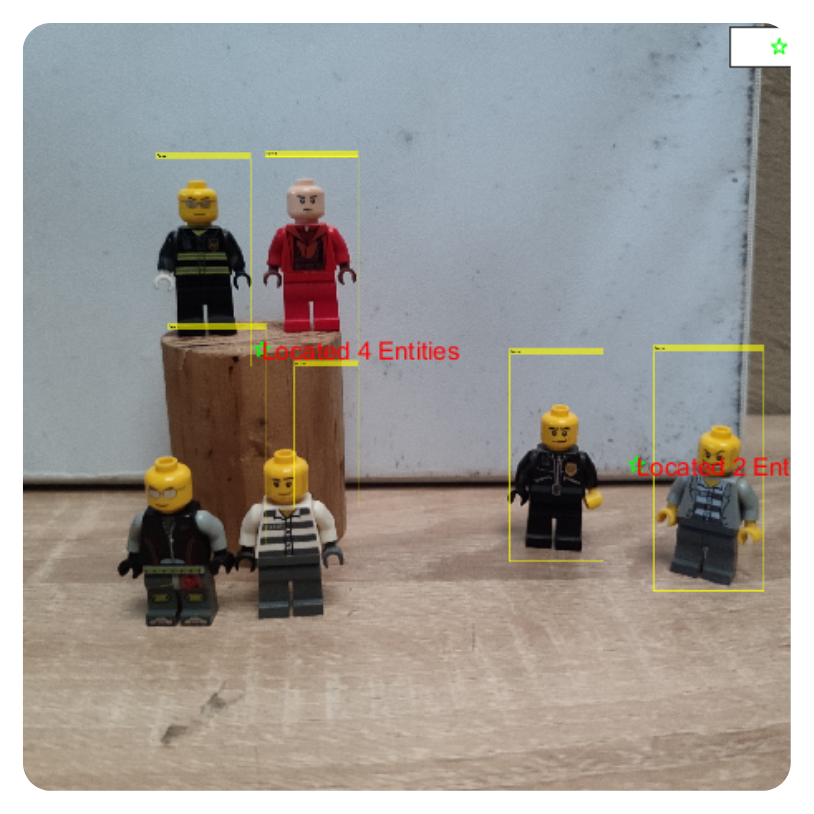

# CrowdClusterLocator

Computer vision system that detects and spatially clusters groups of people in static images using a custom-trained Haar Cascade classifier and a Winner-Takes-All network implemented from scratch in MATLAB. Academic project from my Neuro-Fuzzy Systems course at UPIITA–IPN (2023).

---

## What it does

Given an image, the system detects people, extracts their positions, and groups them based on spatial proximity. Each group gets a centroid and a count of how many people belong to it, which is then overlaid on the original image.

The idea came from wanting to do something beyond basic detection — not just "there are people here" but "these people form a group over there, and those two form another one over here."

---

## How it works

### 1. Training the classifier (`PersonIdentifyer.m`)
I built the dataset myself — took photos of Lego minifigures in different positions, lighting conditions and backgrounds, labeled them manually as positives and negatives, and trained a Haar Cascade classifier from scratch using MATLAB's `trainCascadeObjectDetector`. 9 cascade stages, false alarm rate of 0.1. No pre-trained models used.

### 2. Detection & filtering (`TestLocator.m`, `CrowdDetector.m`)
The classifier runs on the input image and returns bounding boxes. These get filtered by size to drop obvious false positives before moving to the next step.

### 3. Spatial clustering via WTA network (`CrowdDetector.m`)
This is the core part. Once detections are filtered:
- Centroid coordinates are extracted from each bounding box
- A full pairwise Euclidean distance matrix is computed across all points
- Initial weight vectors **W** are seeded from nearest-neighbor midpoints
- A **Winner-Takes-All network** runs for 1000 epochs (α = 0.1): each input point activates its closest neuron, which then moves toward that point
- After training, every pixel in the image space gets assigned to its nearest centroid — this gives you the colored zone map
- People are counted per cluster; groups with ≥ 2 entities get reported on the image

At the time I built this I didn't know this was essentially competitive learning / unsupervised clustering. I just knew I needed something that would pull centroids toward where people actually were. Made sense when I later studied it formally.

---

## Pipeline

```
Load image
    ↓
Detect persons
    ↓
Filter by bounding box size
    ↓
Extract centroids
    ↓
Compute distance matrix
    ↓
Initialize W from nearest pairs
    ↓
Train WTA network
    ↓
Assign detections to clusters
    ↓
Visualize + count
```

---

## Results

Tested on photos of Lego minifigures arranged in different spatial configurations. The system correctly identified two spatial clusters in the main test case:

- **Group 1:** 4 entities (figures elevated + figures on floor, left side)
- **Group 2:** 2 entities (figures on right side)




---

## Limitations

- Classifier needs the full body visible — partial occlusions hurt detection rate
- Busy or cluttered backgrounds cause false positives
- Sensitive to lighting and objects with similar shapes to the training data
- Small custom dataset — a larger and more diverse training set would improve generalization significantly

These were known constraints at the time. The classifier was trained on a small controlled dataset because that's what I had available as a student.

---

## Files

| File | Description |
|------|-------------|
| `CrowdDetector.m` | Full pipeline: detection → clustering → visualization |
| `PersonIdentifyer.m` | Trains the Haar Cascade classifier |
| `TestLocator.m` | Tests the classifier on a single image |
| `People.mat` | Positive instances for classifier training |
| `PersonLocator.xml` | Trained classifier model |
| `data/` | Test images Negatives (Background) & Positives (Objects) |
| `results/` | Output screenshots |

---

## Stack

MATLAB — Computer Vision Toolbox, `vision.CascadeObjectDetector`, `trainCascadeObjectDetector`, `compet()`

---

## Context

This was built for the Neuro-Fuzzy Systems and Artificial Vision courses at UPIITA–IPN. The curriculum covered CNNs, RNNs, Adaline and competitive learning networks. This project was my attempt to combine both courses into something that actually did something useful, built mostly from first principles without external ML frameworks.

Documenting it now because I think it holds up better than I gave it credit for at the time.
